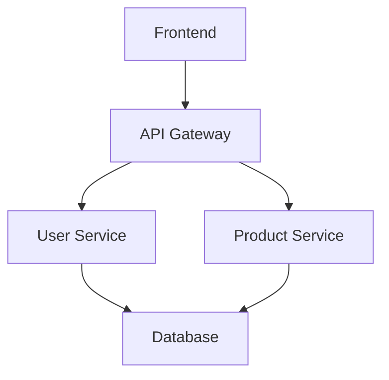
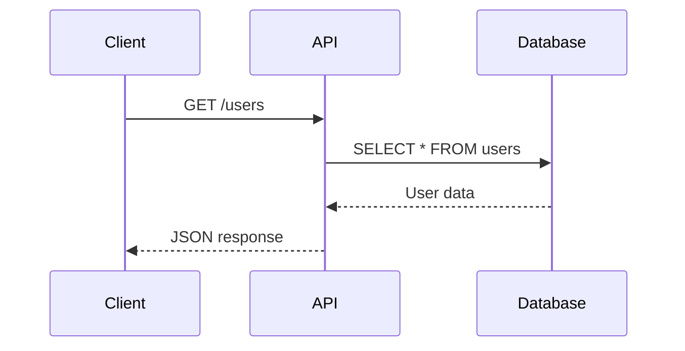

# Sirelia - Real-time Mermaid Diagram Generation

Sirelia is an npm package that provides real-time Mermaid diagram generation and visualization. It includes a web interface for editing diagrams and a file watcher that automatically updates diagrams when you save your `.sirelia.mdd` file.

## Features

### 🎯 Core Functionality
- **Real-time Mermaid Rendering**: Instant preview of diagrams as you edit
- **File Watcher**: Automatically detects changes in `.sirelia.mdd` files
- **Web Interface**: Modern, intuitive interface for diagram editing
- **CodeMirror Editor**: Advanced code editing with syntax highlighting
- **Multiple Diagram Support**: Handle multiple diagrams in a single file

### 🎨 User Interface
- **Resizable Panels**: Flexible layout with collapsible and resizable panels
- **Modern Design**: Clean, responsive interface built with Tailwind CSS
- **Real-time Updates**: See changes instantly as you edit
- **Theme Support**: Light and dark mode support

### 🔧 Technical Stack
- **Next.js 15**: App Router with TypeScript
- **Tailwind CSS**: Utility-first styling
- **CodeMirror 6**: Advanced code editor
- **Mermaid v11**: Diagram rendering engine
- **WebSocket**: Real-time communication
- **Chokidar**: File watching capabilities

## Quick Start

### Installation

Install Sirelia as a **dev dependency**:

```bash
npm install --save-dev sirelia
```

or with yarn:

```bash
yarn add --dev sirelia
```

### Initialize in Your Project

```bash
npx sirelia init
```

This will:
- Create a `.sirelia.mdd` file with example diagrams
- Add `.sirelia.mdd` to your `.gitignore`
- Add a `sirelia:start` script to your `package.json`

### Start Sirelia

```bash
npm run sirelia:start
```

This will:
- Start the web server on http://localhost:3000
- Start the bridge server on port 3001
- Watch your `.sirelia.mdd` file for changes
- Automatically send updates to the web interface

## Usage

### 1. Edit Your Diagrams

Open the `.sirelia.mdd` file in your favorite editor and add Mermaid diagrams:

```markdown
# My Project Architecture



## API Flow


```

### 2. View in Web Interface

Open http://localhost:3000 to see your diagrams rendered in real-time. The web interface provides:

- **Diagram Viewer**: See your diagrams with zoom, pan, and export options
- **Code Editor**: Edit Mermaid syntax with full IDE features
- **Real-time Updates**: Changes appear instantly as you save your file

### 3. Advanced Usage

#### Custom Ports

```bash
npx sirelia start --port 8080 --bridge-port 8081
```

#### Watch Different File

```bash
npx sirelia start --watch diagrams.md
```

#### Force Reinitialize

```bash
npx sirelia init --force
```

## Supported Diagram Types

- **Flowcharts**: `graph TD`, `flowchart LR`
- **Sequence Diagrams**: `sequenceDiagram`
- **Class Diagrams**: `classDiagram`
- **State Diagrams**: `stateDiagram-v2`
- **Entity Relationship**: `erDiagram`
- **User Journey**: `journey`
- **Gantt Charts**: `gantt`
- **Pie Charts**: `pie`
- **Git Graphs**: `gitgraph`
- **Mind Maps**: `mindmap`
- **Timeline**: `timeline`

## CLI Commands

### `sirelia init [options]`

Initialize Sirelia in the current project.

**Options:**
- `-f, --force`: Force overwrite existing configuration

### `sirelia start [options]`

Start the Sirelia web server and bridge.

**Options:**
- `-p, --port <port>`: Web server port (default: 3000)
- `-b, --bridge-port <port>`: Bridge server port (default: 3001)
- `-w, --watch <file>`: Watch specific file (default: .sirelia.mdd)

## Project Structure

After initialization, your project will have:

```
your-project/
├── .sirelia.mdd          # Your Mermaid diagrams
├── .gitignore           # Updated to ignore .sirelia.mdd
└── package.json         # Updated with sirelia:start script
```

## Development

### Building the Package

```bash
npm run package:build
```

### Publishing

```bash
npm publish
```

## Contributing

1. Fork the repository
2. Create a feature branch
3. Make your changes
4. Add tests if applicable
5. Submit a pull request

## License

This project is licensed under the MIT License.

## Roadmap

- [x] File watcher for automatic updates
- [x] Web interface for diagram editing
- [x] Real-time WebSocket communication
- [x] CLI commands for easy setup
- [ ] AI-powered diagram generation
- [ ] Repository integration
- [ ] Export functionality (PNG, SVG, PDF)
- [ ] Collaboration features
- [ ] Custom themes and styling
- [ ] Plugin system for diagram types
