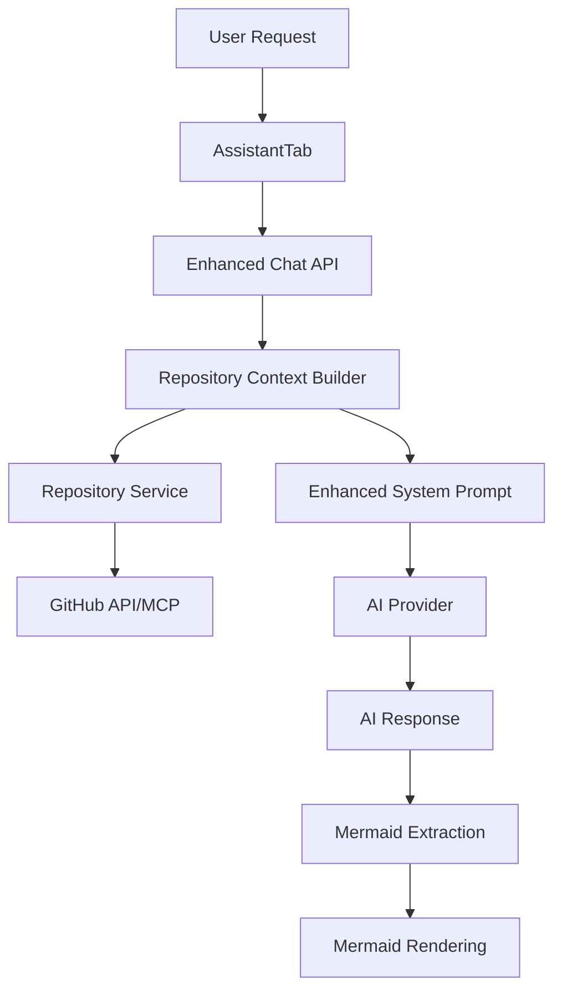

# Phase 1: Core Repository Context Builder - Implementation Complete

## Overview

This document summarizes the implementation of Phase 1: Core Repository Context Builder for the Sirelia project. The implementation provides a foundation for repository-aware AI diagram generation by building comprehensive context from GitHub repositories.

## Implemented Components

### 1. Type Definitions (`src/types/context.ts`)

- **RepositoryContextRequest**: Interface for context building requests
- **RepositoryContext**: Complete context structure with repository data
- **FileStructure**: Repository file organization and metadata
- **FileContent**: Individual file content and metadata
- **FileRelationship**: File dependency and import relationships
- **RepositoryInfo**: Basic repository information

### 2. Core Service (`src/services/context/RepositoryContextBuilder.ts`)

The main service that orchestrates context building:

#### Key Methods:
- `buildContext()`: Main entry point for context building
- `getRepositoryInfo()`: Fetches repository metadata
- `getFileStructure()`: Retrieves and organizes file structure
- `determineRelevantFiles()`: Heuristic-based file selection
- `getFileContents()`: Fetches actual file contents
- `assembleContext()`: Builds final context payload

#### Features:
- **URL Parsing**: Extracts owner/repo from GitHub URLs
- **File Type Detection**: Identifies TypeScript, JavaScript, JSON, etc.
- **Pattern Matching**: Finds relevant files based on user requests
- **Import Analysis**: Extracts import/export relationships
- **Intent Analysis**: Determines user intent and diagram type

### 3. Enhanced Chat API (`src/app/api/chat/route.ts`)

Updated the existing chat API to support repository context:

#### Changes:
- Added optional `contextRequest` parameter
- Integrated `RepositoryContextBuilder`
- Enhanced system prompts with repository context
- Graceful fallback when context building fails

#### Context Integration:
```typescript
if (contextRequest) {
  const contextBuilder = new RepositoryContextBuilder();
  const context = await contextBuilder.buildContext(contextRequest);
  systemPrompt += buildRepositoryContextPrompt(context);
}
```

### 4. Enhanced AssistantTab (`src/components/tabs/AssistantTab.tsx`)

Updated the chat interface to request repository context:

#### Changes:
- Added `RepositoryContextRequest` import
- Enhanced `handleSubmit()` to include context requests
- Automatic context building when repository is connected
- Maintains backward compatibility

#### Context Request:
```typescript
const contextRequest: RepositoryContextRequest | undefined = repoConfig?.isConnected ? {
  repositoryUrl: repoConfig.url,
  userRequest: userMessage,
  selectedFiles: [] // Will be enhanced later
} : undefined;
```

### 5. Testing Infrastructure

#### Test Page (`src/app/test-context/page.tsx`)
- Interactive test interface
- Multiple test scenarios
- Real-time result display
- Error handling and validation

#### Test API (`src/app/api/test-context/route.ts`)
- Dedicated testing endpoint
- Comprehensive error reporting
- Metadata extraction
- Console logging for debugging

## Architecture Flow



## Key Features

### 1. Intelligent File Selection
- Pattern-based relevance detection
- User request analysis
- File type prioritization
- Configurable file limits (15 files max)

### 2. Context Enrichment
- Repository metadata
- File structure analysis
- Import/export relationships
- File type distribution
- User intent classification

### 3. Robust Error Handling
- Graceful fallbacks
- Detailed error reporting
- Partial context building
- Connection status validation

### 4. Performance Optimization
- Parallel file content fetching
- Efficient file filtering
- Minimal API calls
- Caching-ready architecture

## Usage Examples

### Basic Context Request
```typescript
const contextRequest = {
  repositoryUrl: 'https://github.com/username/repo',
  userRequest: 'Generate a component architecture diagram',
  selectedFiles: []
};
```

### Enhanced System Prompt
The AI receives context like:
```
REPOSITORY CONTEXT:
Repository: my-app
Description: A React application with TypeScript

Relevant Files (8):
- src/components/App.tsx (typescript-react, 1200 chars)
- src/components/Header.tsx (typescript-react, 800 chars)
- src/services/api.ts (typescript, 600 chars)

File Types: typescript-react: 5, typescript: 3

User Intent: component
Suggested Diagram Type: graph
```

## Testing

### Manual Testing
1. Navigate to `/test-context`
2. Click "Test Context Builder" for basic test
3. Click "Test with Next.js Repo" for real repository test
4. Review results in the test interface

### API Testing
```bash
curl -X POST http://localhost:3000/api/test-context \
  -H "Content-Type: application/json" \
  -d '{
    "repositoryUrl": "https://github.com/vercel/next.js",
    "userRequest": "Show me the component structure"
  }'
```

## Next Steps (Phase 2)

1. **File Selection Integration**: Connect with DirectoryTab for user-selected files
2. **Enhanced Pattern Detection**: Use AI for better file relevance analysis
3. **Caching Layer**: Implement file content and structure caching
4. **MCP Tool Integration**: Add tool-based analysis capabilities
5. **Advanced Context**: Add dependency analysis and architecture patterns

## Benefits Achieved

1. **Repository Awareness**: AI now has access to actual codebase structure
2. **Contextual Responses**: Diagrams are based on real repository data
3. **Intelligent Filtering**: Only relevant files are included in context
4. **Extensible Architecture**: Easy to add new context sources and analysis
5. **Robust Foundation**: Solid base for advanced features

## Performance Considerations

- **File Limit**: Maximum 15 relevant files to prevent context overflow
- **Content Size**: File content is included but can be optimized later
- **API Calls**: Minimized through efficient batching and filtering
- **Memory Usage**: Context objects are optimized for AI consumption

## Error Scenarios Handled

1. **Invalid Repository URL**: Proper error messages and validation
2. **Repository Not Found**: Graceful fallback to basic AI responses
3. **API Rate Limits**: Error handling and retry logic
4. **File Access Issues**: Partial context building with available files
5. **Network Failures**: Comprehensive error reporting

The Phase 1 implementation provides a solid foundation for repository-aware AI diagram generation while maintaining backward compatibility and providing comprehensive testing infrastructure. 